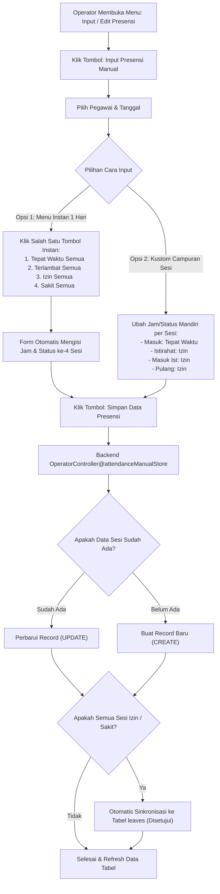

# DOKUMENTASI TEKNIS: FITUR INPUT & EDIT PRESENSI MANUAL SERTA VALIDASI IZIN/CUTI
**Sistem Presensi & Kepegawaian - Pengadilan Tinggi Pontianak**

---

## 1. Latar Belakang & Tujuan Fitur

Fitur ini dikembangkan untuk menjawab kebutuhan operasional pengelolaan presensi harian di Pengadilan Tinggi Pontianak:
1. **Fleksibilitas Input Presensi bagi Operator**:
   - Mengakomodasi pegawai yang mengalami kendala teknis (kamera/GPS rusak), penugasan dinas mendadak di luar kantor, atau lupa melakukan absensi.
   - Memungkinkan pencatatan status presensi per sesi secara bebas (contoh: pagi hadir tepat waktu, sedangkan siang berstatus izin atau sakit).
   - Menyediakan **Paket Instan 1 Hari** (1 kali klik) untuk mengisi 4 sesi secara serentak: *Tepat Waktu Semua*, *Terlambat Semua*, *Izin Semua*, atau *Sakit Semua*.
2. **Integritas Pengajuan Izin/Cuti bagi Pegawai**:
   - Mencegah pegawai (*user/karyawan*) mengajukan izin/cuti untuk **tanggal yang telah lewat (kemarin atau sebelumnya)**.
   - Hak input tanggal lampau (*backdate*) tetap diberikan eksklusif kepada **Admin/Operator** untuk pencatatan berita acara resmi.

---

## 2. Diagram Alur Kerja (Workflow)



---

## 3. Struktur Database & Model Eloquent

### A. Tabel `attendances` (Database Migration)
Pada tabel `attendances`, kolom `status` diperbarui untuk mendukung status izin dan sakit selain ketepatan waktu.

- **Migration**: [2026_09_03_102236_update_status_enum_in_attendances_table.php](file:///C:/laragon/www/absensi/database/migrations/2026_09_03_102236_update_status_enum_in_attendances_table.php)
```php
public function up(): void
{
    DB::statement("ALTER TABLE `attendances` MODIFY COLUMN `status` ENUM('tepat_waktu', 'terlambat', 'lebih_awal', 'izin', 'sakit') NOT NULL DEFAULT 'tepat_waktu'");
}
```

- **Constraint Unik Penting**:
  Tabel ini memiliki indeks unik komposit pada `['user_id', 'tanggal', 'tipe']`. Artinya, 1 pegawai pada 1 tanggal hanya dapat memiliki 1 rekaman per sesi (`masuk`, `istirahat`, `masuk_istirahat`, `pulang`). Sistem menangani ini dengan otomatis melakukan `update` jika rekaman sudah ada.

### B. Model Eloquent: [Attendance.php](file:///C:/laragon/www/absensi/app/Models/Attendance.php)

1. **Helper Label Status**:
```php
public static function getStatusLabel(string $status): string
{
    return match ($status) {
        'tepat_waktu' => 'Tepat Waktu',
        'terlambat'   => 'Terlambat',
        'lebih_awal'  => 'Lebih Awal',
        'izin'        => 'Izin',
        'sakit'       => 'Sakit',
        default       => ucfirst(str_replace('_', ' ', $status)),
    };
}
```

2. **Helper Lencana (Badge) UI**:
```php
public static function getStatusBadge(string $status): array
{
    return match ($status) {
        'tepat_waktu' => [
            'label' => 'Tepat Waktu',
            'bg'    => 'bg-emerald-100 text-emerald-800 border-emerald-300',
            'icon'  => 'fa-solid fa-check',
        ],
        'terlambat' => [
            'label' => 'Terlambat',
            'bg'    => 'bg-amber-100 text-amber-800 border-amber-300',
            'icon'  => 'fa-solid fa-clock-rotate-left',
        ],
        'lebih_awal' => [
            'label' => 'Lebih Awal',
            'bg'    => 'bg-teal-100 text-teal-800 border-teal-300',
            'icon'  => 'fa-solid fa-business-time',
        ],
        'izin' => [
            'label' => 'Izin',
            'bg'    => 'bg-indigo-100 text-indigo-800 border-indigo-300',
            'icon'  => 'fa-solid fa-envelope-open-text',
        ],
        'sakit' => [
            'label' => 'Sakit',
            'bg'    => 'bg-rose-100 text-rose-800 border-rose-300',
            'icon'  => 'fa-solid fa-notes-medical',
        ],
        default => [
            'label' => ucfirst(str_replace('_', ' ', $status)),
            'bg'    => 'bg-slate-100 text-slate-800 border-slate-300',
            'icon'  => 'fa-solid fa-circle-info',
        ],
    };
}
```

3. **Deteksi Presensi Manual & Fallback Gambar**:
```php
public function isManual(): bool
{
    return str_contains(strtolower($this->alamat ?? ''), 'manual')
        || str_contains(strtolower($this->ip_address ?? ''), 'manual')
        || str_contains(strtolower($this->foto ?? ''), 'manual');
}

public function getFotoUrlAttribute(): string
{
    if (!empty($this->foto) && file_exists(public_path($this->foto))) {
        return asset($this->foto);
    }
    return asset('images/manual_attendance.png');
}
```

---

## 4. Routing Web ([web.php](file:///C:/laragon/www/absensi/routes/web.php))

Grup rute operator diperluas untuk mengelola modul presensi:

| HTTP Method | URI | Nama Rute | Action Controller | Fungsi |
|---|---|---|---|---|
| `GET` | `/operator/attendances` | `operator.attendances.index` | `OperatorController@attendanceManageIndex` | Menampilkan tabel presensi harian, metrik, filter, dan modal input. |
| `POST` | `/operator/attendances/manual` | `operator.attendances.manual-store` | `OperatorController@attendanceManualStore` | Memproses penyimpanan presensi multi-sesi atau paket instan. |
| `GET` | `/operator/attendances/{id}/json` | `operator.attendances.show-json` | `OperatorController@attendanceShowJson` | Endpoint JSON AJAX untuk memuat data saat modal Edit dibuka. |
| `PUT` | `/operator/attendances/{id}` | `operator.attendances.update` | `OperatorController@attendanceUpdate` | Memperbarui jam, status, catatan, atau foto sesi presensi. |
| `DELETE` | `/operator/attendances/{id}` | `operator.attendances.destroy` | `OperatorController@attendanceDestroy` | Menghapus data presensi yang salah/keliru. |

---

## 5. Logika Controller Operator ([OperatorController.php](file:///C:/laragon/www/absensi/app/Http/Controllers/OperatorController.php))

### A. Metode `attendanceManageIndex(Request $request)`
- Menerima filter: `tanggal`, `user_id`, `tipe`, `status`, `sumber` (manual/karyawan), dan `search` (nama/NIP).
- Menghitung metrik ringkasan untuk tanggal aktif:
  - `$totalAll`: Total sesi tercatat
  - `$totalTepatWaktu`: Total sesi tepat waktu
  - `$totalTerlambat`: Total sesi terlambat
  - `$totalIzin`: Total sesi berstatus izin
  - `$totalSakit`: Total sesi berstatus sakit
  - `$totalManual`: Total sesi yang berasal dari input manual operator.

### B. Metode `attendanceManualStore(Request $request)`
Metode utama yang menangani input manual:
1. **Validasi**:
   - `user_id` wajib dipilih dan ada di tabel `users`.
   - `tanggal` wajib tanggal valid (tidak dibatasi tanggal lampau untuk operator).
   - `sessions` minimal memilih 1 sesi (`masuk`, `istirahat`, `masuk_istirahat`, `pulang`).
2. **Pemrosesan Tiap Sesi**:
   - Mengambil jam input per sesi (`jam_masuk`, `jam_istirahat`, dll.) dengan fallback ke jam target jadwal kantor (`Schedule::getScheduleForDate`).
   - Mengambil status per sesi (`status_masuk`, dll.): `tepat_waktu`, `terlambat`, `lebih_awal`, `izin`, atau `sakit`.
   - Melakukan pengecekan rekaman yang sudah ada:
     - Jika sudah ada: melakukan **`update()`** dengan waktu dan status baru.
     - Jika belum ada: melakukan **`create()`** dengan koordinat kantor dan penanda `ip_address = 'Manual (Operator)'`.
3. **Sinkronisasi Otomatis ke Model `Leave`**:
   - Jika semua sesi yang diinputkan berstatus `sakit` atau `izin`, sistem otomatis mencatatkan atau memperbarui data di tabel `leaves` dengan `status = 'disetujui'`. Dengan demikian, laporan bulanan/rekap instansi yang membaca model cuti otomatis sinkron tanpa perlu input dua kali!

### C. Metode `attendanceUpdate(Request $request, $id)`
- Validasi status diperluas: `'status' => 'required|in:tepat_waktu,terlambat,lebih_awal,izin,sakit'`.
- Memeriksa duplikasi rekaman jika operator mengubah tanggal atau sesi agar tidak melanggar composite unique key `(user_id, tanggal, tipe)`.

---

## 6. Pembatasan Tanggal Lampau Khusus User (Karyawan)

Sesuai instruksi: *"user tidak bisa ajukan cuti/izin ke tanggal yang telah lewat, ingat hanya user,,, kalau admin tidak ada perubahan, boleh semua"*.

### A. Lapisan Backend: [KaryawanController.php](file:///C:/laragon/www/absensi/app/Http/Controllers/KaryawanController.php#L454-L468)
Pada method `leaveStore(Request $request)`:
```php
$validated = $request->validate([
    'jenis_cuti'      => 'required|in:cuti_tahunan,cuti_sakit,cuti_luar_negeri,cuti_alasan_penting,cuti_lainnya',
    'tanggal_mulai'   => 'required|date|after_or_equal:today',
    'tanggal_selesai' => 'required|date|after_or_equal:tanggal_mulai',
    'alasan'          => 'required|string|max:1000',
    'dokumen'         => 'nullable|file|mimes:pdf,jpg,jpeg,png|max:5120',
], [
    'tanggal_mulai.after_or_equal' => 'Pengajuan izin/cuti tidak dapat dilakukan untuk tanggal yang telah lewat (hanya untuk hari ini atau tanggal mendatang).',
]);
```
- Aturan `after_or_equal:today` memastikan jika user mengirimkan tanggal kemarin atau sebelumnya (bahkan via manipulasi inspect element/API postman), server akan menolak dengan error 422.
- Pada `OperatorController`, aturan `after_or_equal:today` **TIDAK DITERAPKAN**, sehingga Operator/Admin tetap bebas memasukkan tanggal kapan saja (*backdate*).

### B. Lapisan Frontend: [cuti.blade.php](file:///C:/laragon/www/absensi/resources/views/karyawan/cuti.blade.php#L105-L115)
Input datepicker HTML dibatasi dengan atribut `min`:
```html
<input type="date" name="tanggal_mulai" id="tanggal_mulai" required min="{{ date('Y-m-d') }}" value="{{ old('tanggal_mulai', date('Y-m-d')) }}">
<input type="date" name="tanggal_selesai" id="tanggal_selesai" required min="{{ date('Y-m-d') }}" value="{{ old('tanggal_selesai', date('Y-m-d')) }}">
```
Ditambah event listener JavaScript untuk menyinkronkan batas minimal `tanggal_selesai` mengikuti `tanggal_mulai`:
```javascript
tglMulai.addEventListener('change', function() {
    if (this.value) {
        tglSelesai.min = this.value;
        if (tglSelesai.value && tglSelesai.value < this.value) {
            tglSelesai.value = this.value;
        }
    }
});
```

---

## 7. Desain Frontend Modal Operator ([index.blade.php](file:///C:/laragon/www/absensi/resources/views/operator/attendances/index.blade.php))

### A. Fitur Tanpa Emoji
Semua simbol grafis menggunakan ikon SVG FontAwesome standar (`fa-solid fa-circle-check`, `fa-solid fa-clock-rotate-left`, `fa-solid fa-envelope-open-text`, `fa-solid fa-notes-medical`) tanpa ada karakter emoji unicode (seperti ⚡, 💊, 📝).

### B. Logika Menu Paket Instan 1 Hari (`applyPreset(presetType)`)
Fungsi JavaScript ini bertugas mengubah ke-4 sesi dalam 1 kali klik:
```javascript
function applyPreset(presetType) {
    const dateInput = document.getElementById('create_tanggal');
    const isFriday = (new Date(dateInput.value)).getDay() === 5;
    const baseHours = isFriday ? scheduleHours.friday : scheduleHours.normal;

    // 1. Centang semua 4 sesi
    ['masuk', 'istirahat', 'masuk_istirahat', 'pulang'].forEach(tipe => {
        document.getElementById(`check_${tipe}`).checked = true;
    });

    if (presetType === 'tepat_waktu') {
        setAllSessions(baseHours, 'tepat_waktu', 'Hadir lengkap 1 hari (tepat waktu)');
    } else if (presetType === 'terlambat') {
        // Masuk & Masuk Istirahat terlambat, Istirahat & Pulang lebih awal
        setSessionValues('masuk', '08:35', 'terlambat');
        setSessionValues('istirahat', baseHours.istirahat, 'lebih_awal');
        setSessionValues('masuk_istirahat', '13:35', 'terlambat');
        setSessionValues('pulang', '16:45', 'lebih_awal');
    } else if (presetType === 'izin') {
        setAllSessions(baseHours, 'izin', 'Izin tidak hadir 1 hari');
    } else if (presetType === 'sakit') {
        setAllSessions(baseHours, 'sakit', 'Sakit tidak hadir 1 hari');
    }
}
```

### C. Fleksibilitas Kustom Campuran
Operator tidak wajib menggunakan paket instan. Operator dapat:
1. Memilih pegawai & tanggal.
2. Mengatur **Jam Masuk = Tepat Waktu (08:00)**.
3. Mengatur **Jam Istirahat = Izin**.
4. Mengatur **Masuk Istirahat = Izin**.
5. Mengatur **Jam Pulang = Izin**.
6. Menambahkan catatan: *"Pagi hadir rapat, siang izin mengurus keperluan keluarga"*.
7. Menyimpan data presensi.

---

## 8. Ringkasan File yang Dimodifikasi

1. **[OperatorController.php](file:///C:/laragon/www/absensi/app/Http/Controllers/OperatorController.php)**: Penanganan `attendanceManageIndex`, `attendanceManualStore`, `attendanceUpdate`, metrik izin/sakit, dan sinkronisasi laporan rekap.
2. **[KaryawanController.php](file:///C:/laragon/www/absensi/app/Http/Controllers/KaryawanController.php)**: Pembatasan validasi tanggal pengajuan cuti (`after_or_equal:today`).
3. **[Attendance.php](file:///C:/laragon/www/absensi/app/Models/Attendance.php)**: Penambahan status `izin` dan `sakit` pada `getStatusLabel()` dan `getStatusBadge()`.
4. **[AttendanceExportService.php](file:///C:/laragon/www/absensi/app/Services/AttendanceExportService.php)**: Perhitungan akumulasi statistik `izin` dan `sakit` dalam export Excel rekap.
5. **[create_attendances_table.php](file:///C:/laragon/www/absensi/database/migrations/2026_08_11_000002_create_attendances_table.php)** & **[update_status_enum_in_attendances_table.php](file:///C:/laragon/www/absensi/database/migrations/2026_09_03_102236_update_status_enum_in_attendances_table.php)**: Update enum kolom database.
6. **[index.blade.php](file:///C:/laragon/www/absensi/resources/views/operator/attendances/index.blade.php)**: Antarmuka baru modal input manual bebas emoji, 4 tombol instan, dan multi-sesi.
7. **[cuti.blade.php](file:///C:/laragon/www/absensi/resources/views/karyawan/cuti.blade.php)**: Batasan kalender minimal hari ini untuk user.
